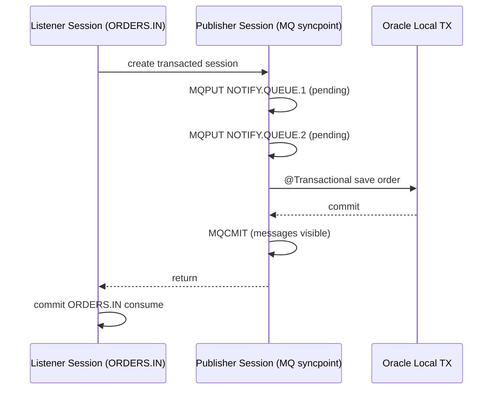

# Architecture

## Sequence of local transactions

## Failure modes

- DB failure: publisher session rolls back, outgoing messages are discarded, listener rolls back incoming message.
- MQ publish failure: DB work is not committed, listener rolls back incoming message.
- Crash window (after DB commit, before publisher commit): DB is committed, outgoing messages are not visible, incoming message is redelivered.

This flow provides at-least-once processing with explicit idempotency on `order_id`.
