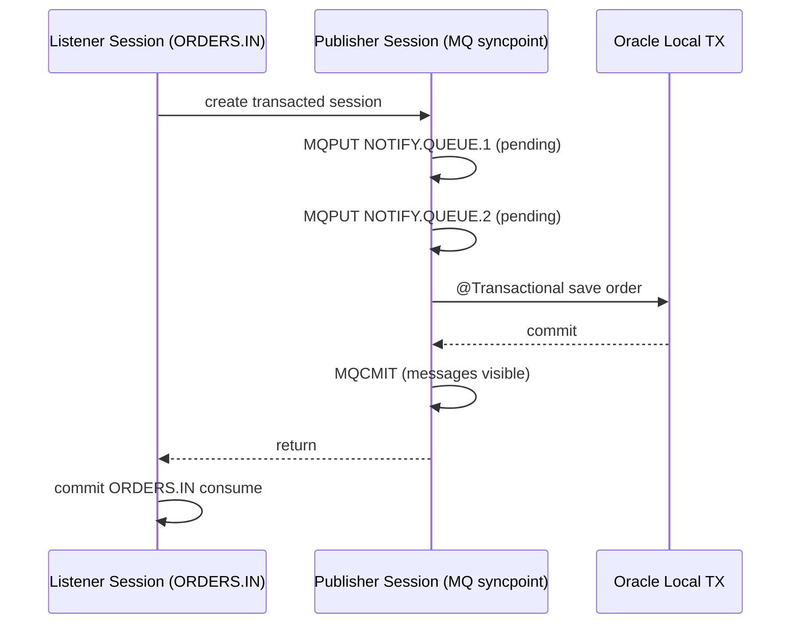

# Architecture

## Sequence of local transactions

## Failure modes

- DB failure: publisher session rolls back, outgoing messages are discarded, listener rolls back incoming message.
- MQ publish failure (most important rollback-safety path): MQPUT fails before DB commit, so DB work is rolled back and publisher-session pending messages are discarded.
- Crash window (after DB commit, before publisher commit): DB is committed, outgoing messages are not visible, incoming message is redelivered.

This flow provides at-least-once processing with explicit idempotency on `order_id`.

## Reliability intent

The staged sequence (MQPUT under syncpoint first, DB commit second, MQCMIT third) is designed to reduce the likelihood of MQ commit-window failures by surfacing MQ/network/QM issues early while DB is still rollback-safe.
It does not eliminate the crash window: successful MQPUT makes immediate MQCMIT likely, but not guaranteed.
